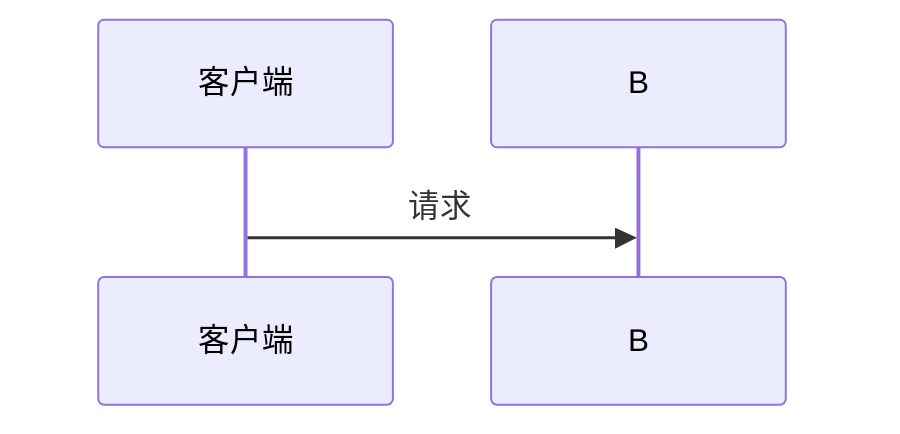

# Markdown 嵌套代码块写法 Skill

## 问题

在编写 SKILL.md 或其他 Markdown 文档时，经常需要**展示包含代码块的代码示例**。比如：

````
```
在 Mermaid 代码块中加配置：

```mermaid
%%{init: {"sequence": {"useMaxWidth": true}}}%%
sequenceDiagram
    ...
```
```
````

这里外层用 ```` ``` ````（3 个反引号）定义了一个代码块，但内容里又出现了 ```` ```mermaid ````（也是 3 个反引号），内层的 fence 会提前关闭外层代码块，导致剩余内容脱离代码块，产生语法错误。

## 原理

Markdown 的 fenced code block 规则：

- 用连续反引号（````` ``` `````）或波浪线（````` ~~~ `````）包裹
- 解析器遇到**第一个同长度 fence** 就关闭当前代码块
- 内外层同长度 → 内层 fence 被当作"关闭信号" → 后续内容脱离代码块 → 语法错误

## 修复方案

### 方案一：外层 fence 加长（最推荐）

外层用 4 个或 5 个反引号，内层保持 3 个：

`````markdown
````markdown
### 示例

````
`````

**原则**：外层 fence 长度 = 内层 fence 长度 + 1（或更多），这样内层 fence 不会被误认为结束标记。

### 方案二：外层用波浪线 `~~~`

`````markdown
~~~markdown
### 示例

~~~
`````

波浪线和反引号不互斥，可以相互嵌套。

### 方案三：缩进式代码块（简单场景）

每行前加 4 个空格（或 1 个 Tab），不需要 fence：

```
    ```mermaid
    %%{init: {"sequence": {"useMaxWidth": true}}}%%
    sequenceDiagram
        participant A as 客户端
        A->>B: 请求
    ```
```

缺点：内部无法再嵌套 Mermaid 渲染（被当作纯文本展示），适合简单场景。

### 方案四：HTML 实体编码（极端情况）

当需要展示 fence 本身时，用 `&amp;#96;&amp;#96;&amp;#96;` 表示反引号：

```markdown
&amp;#96;&amp;#96;&amp;#96;mermaid
%%{init: {"sequence": {"useMaxWidth": true}}}%%
sequenceDiagram
    participant A as 客户端
&amp;#96;&amp;#96;&amp;#96;
```

渲染效果：

&#96;&#96;&#96;mermaid
%%{init: {"sequence": {"useMaxWidth": true}}}%%
sequenceDiagram
    participant A as 客户端
&#96;&#96;&#96;

## 其他常见踩坑点

### 内联代码中的 fence

```markdown
<!-- ❌ 错误：内联代码内出现三个反引号，会与 fence 混淆 -->
在 ` ```mermaid ` 之后插入

<!-- ✅ 正确：换一种说法 -->
在 Mermaid 代码块第一行插入
```

规则：**内联代码（`...`）内部不要出现三个及以上反引号**，否则解析器会误判为 fence 开始。

### 嵌套层级速查表

| 嵌套层数 | 外层 fence | 内层 fence |
|---------|-----------|-----------|
| 0 层（无嵌套） | 3 个反引号 | — |
| 1 层 | 4 个反引号 | 3 个反引号 |
| 2 层 | 5 个反引号 | 4 或 3 个反引号 |
| 3 层 | 6 个反引号 | 依此类推 |

简单记：**外层比内层多 1 个反引号**即可。

## 如何检查

写完 SKILL.md 后，在 VSCode 中按 `Ctrl+K V` 打开侧边预览，检查：

1. 代码块颜色是否正常区隔（嵌套块不会"染"到正文）
2. 代码示例中的 `mermaid` 代码块是否被正确渲染为图形而非文本
3. 缩进式代码块是否保持了内部格式
