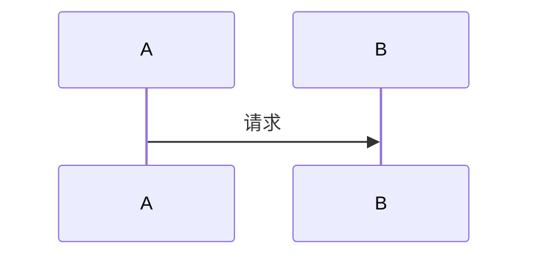
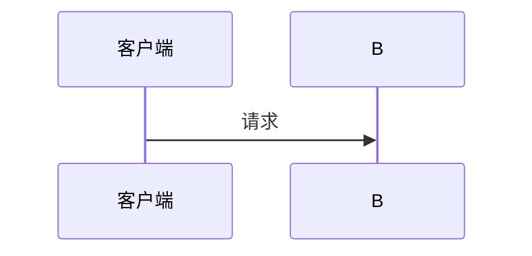
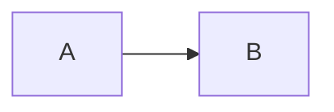

# Markdown 嵌套代码块写法 Skill

## 问题

在编写 SKILL.md 或其他 Markdown 文档时，经常需要**展示包含代码块的代码示例**。比如：

````
```
在 Mermaid 代码块中加配置：

```mermaid
%%{init: {"sequence": {"useMaxWidth": true}}}%%
sequenceDiagram
    ...
```
```
````

这里外层用 ```` ``` ````（3 个反引号）定义了一个代码块，但内容里又出现了 ```` ```mermaid ````（也是 3 个反引号），内层的 fence 会提前关闭外层代码块，导致剩余内容脱离代码块，产生语法错误。

## 出错表现

fence 嵌套错误不会导致文档崩溃，而是让渲染结果变得**诡异**。以下是几种常见的错误现象：

### 错误 1：代码块后半段"逃逸"成纯文本

**源代码：**
````markdown
```markdown
# 标题
```python
print("hello")
```
```
````

**渲染效果：**
```
# 标题
```
```python                          ← 这行开始脱离代码块，被当作普通文本
print("hello")                     ← 普通文本
```                                ← 被当作新的空代码块
```                                ← 又一个空代码块
```

### 错误 2：代码块中"长出"图形

**源代码：**
````markdown
```markdown
### 注册

```
````

**渲染效果：**

预期：展示一个纯文本的代码示例，让读者看到 mermaid 代码怎么写

实际：mermaid 代码被**渲染成图形**（因为内层 ````mermaid` 关闭了外层代码块，`sequenceDiagram` 暴露在外并被解析器当作真正的 Mermaid 图）

### 错误 3：内联代码中出现 fence

**源代码：**
```markdown
在 ` ```mermaid ` 之后插入
```

**渲染效果：**

预期：显示 "在 `mermaid` 之后插入"（`mermaid` 被当作内联代码）

实际：三个反引号被解析为 fence 的开始/结束，页面布局错乱

### 错误 4：表格中丢内容

**源代码：**
```markdown
| 1 层 | ````` ```` ````` | ````` ``` ````` |
```

**渲染效果：**

表格中的反引号序列被解析器误判为 fence，提前关闭或打断表格，后续行被渲染成普通文本，表格"断尾"。

## 快速诊断清单

在 VSCode 预览中看到以下现象，立即检查 fence：

| 现象 | 怀疑 | 排查方法 |
| ---- | ---- | -------- |
| 代码块中出现了实际渲染的图形（如 Mermaid 图、表格） | 内层 fence 意外关闭了外层代码块 | 检查内外 fence 长度是否相同 |
| 代码块后半段变成纯文本，格式丢失 | fence 在中间被提前关闭 | 检查代码块内是否有同长度 fence |
| 页面中突然出现大量裸 fence（反引号或波浪线序列） | fence 数量不对，有未闭合的代码块 | 数一下开闭 fence 是否成对 |
| 表格显示不全，部分行变成普通文本 | 表格单元格内的 fence 打断了表格 | 检查表格中是否有 3+ 连续反引号 |

## 原理

Markdown 的 fenced code block 规则：

- 用连续反引号（````` ``` `````）或波浪线（````` ~~~ `````）包裹
- 解析器遇到**第一个同长度 fence** 就关闭当前代码块
- 内外层同长度 → 内层 fence 被当作"关闭信号" → 后续内容脱离代码块 → 语法错误

## 修复方案

### 方案一：外层 fence 加长（最推荐）

外层用 4 个或 5 个反引号，内层保持 3 个：

`````markdown
````markdown
### 示例

````
`````

**原则**：外层 fence 长度 = 内层 fence 长度 + 1（或更多），这样内层 fence 不会被误认为结束标记。

### 方案二：外层用波浪线 `~~~`

`````markdown
~~~markdown
### 示例

~~~
`````

波浪线和反引号不互斥，可以相互嵌套。

### 方案三：缩进式代码块（简单场景）

每行前加 4 个空格（或 1 个 Tab），不需要 fence：

```
    ```mermaid
    %%{init: {"sequence": {"useMaxWidth": true}}}%%
    sequenceDiagram
        participant A as 客户端
        A->>B: 请求
    ```
```

缺点：内部无法再嵌套 Mermaid 渲染（被当作纯文本展示），适合简单场景。

### 方案四：HTML 实体编码（极端情况）

当需要展示 fence 本身时，用 `&amp;#96;&amp;#96;&amp;#96;` 表示反引号：

```markdown
&amp;#96;&amp;#96;&amp;#96;mermaid
%%{init: {"sequence": {"useMaxWidth": true}}}%%
sequenceDiagram
    participant A as 客户端
&amp;#96;&amp;#96;&amp;#96;
```

HTML 渲染时 `&amp;#96;` 会解码为反引号，最终读者看到的是 ````mermaid` ... ```` 代码块内容。适合在需要精确展示 fence 语法的场景下使用。

## 其他常见踩坑点

### 内联代码中的 fence

```markdown
<!-- ❌ 错误：内联代码内出现三个反引号，会与 fence 混淆 -->
在 ` ```mermaid ` 之后插入

<!-- ✅ 正确：换一种说法 -->
在 Mermaid 代码块第一行插入
```

规则：**内联代码（`...`）内部不要出现三个及以上反引号**，否则解析器会误判为 fence 开始。

### 嵌套层级速查表

| 嵌套层数 | 外层 fence | 内层 fence |
| -------- | ---------- | ---------- |
| 0 层（无嵌套） | 3 个反引号 | — |
| 1 层 | 4 个反引号 | 3 个反引号 |
| 2 层 | 5 个反引号 | 4 或 3 个反引号 |
| 3 层 | 6 个反引号 | 依此类推 |

简单记：**外层比内层多 1 个反引号**即可。

## Obsidian 表格语法规则

Obsidian 实时预览对 Markdown 表格的解析比标准更严格，以下两条规则必须遵守。

### 规则 1：分隔行必须用空格对齐

分隔行（表头和表体之间的 `---|---` 行）必须**每列用空格隔开**，不能连写：

````markdown
<!-- ❌ 错误：分隔符连写，Obsidian 实时预览不识别 -->
| 类型 | 触发方式 | 核心问题 |
|------|----------|----------|
| 立即执行 | 点击 | 异步处理 |

<!-- ✅ 正确：分隔符间有空格 -->
| 类型 | 触发方式 | 核心问题 |
| ---- | ---------- | ----------- |
| 立即执行 | 点击 | 异步处理 |
````

### 规则 2：代码块和表格之间必须有空行

代码块（` ``` ` 结束符）后面直接跟表格时，中间**必须有空行**，否则表格不渲染：

````markdown
<!-- ❌ 错误：代码块结束后直接写表格，Obsidian 不解析 -->

| 类型 | 说明 |
| ---- | ---- |
| A | B |

<!-- ✅ 正确：代码块和表格之间有空行 -->


| 类型 | 说明 |
| ---- | ---- |
| A | B |
````

这两条规则对 **Typora** 等编辑器无所谓（它们更宽松），但 **Obsidian 实时预览** 严格要求。
