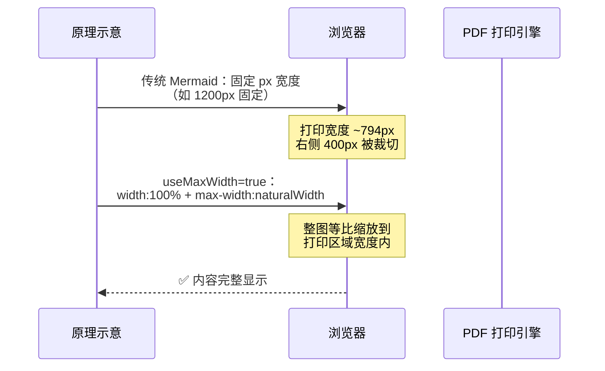
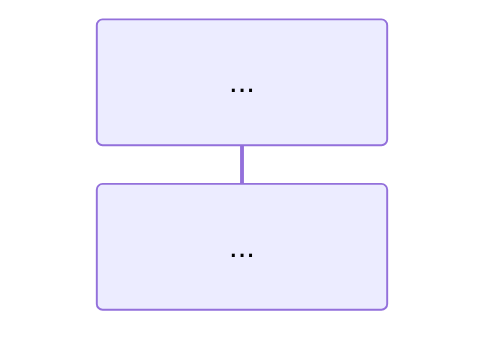

# Mermaid 图表 PDF 打印适配 Skill

## 背景

Markdown 中的 Mermaid 序列图在 HTML 渲染时尺寸正常，但**打印为 PDF 时常被右侧截断**。根本原因是 Mermaid 默认生成固定宽度的 SVG，超过 A4 纸可打印区域宽度（约 700-800px）。

## 核心原理



关键配置就一行：

```
%%{init: {"sequence": {"useMaxWidth": true}}}%%
```

**原理**：`useMaxWidth: true` 使 SVG 采用 `width: 100%; max-width: [naturalWidth]` 的响应式布局。打印时浏览器自动将**整张图等比缩放**到页面可打印区域宽度内，字体、方框、箭头等所有元素同比例缩放，不会出现字大框小或框大字小的问题。

## 修复步骤

### 步骤一：给每个 sequenceDiagram 加 init 配置

在 ` ```mermaid ` 之后、`sequenceDiagram` 之前插入：

```markdown

```

### 步骤二：缩短参与者名称（重要）

参与者名称中的 `<br/>` 会把名称框撑成双倍宽度，是导致图过宽的主要原因之一。

```diff
- participant B as FastAPI<br/>HTTPBearer    ← 名称框极宽
+ participant B as FastAPI HTTPBearer        ← 单行，宽度减半
```

注意：消息箭头内容（`F->>B: POST /auth/login<br/>{username, password}`）中的 `<br/>` 保留，因为它在竖排文本中反而减少宽度。

### 步骤三：不要加固定 width

```diff
- %%{init: {"sequence": {"useMaxWidth": true, "width": 700}}}%%
+ %%{init: {"sequence": {"useMaxWidth": true}}}%%
```

`width: 700` 会固定画布尺寸，导致缩放时字体和方框不同步。只用 `useMaxWidth: true`，让浏览器统一缩放。

### 步骤四（可选）：拆分过大图为多个小图

如果一张图有 10+ 个参与者、20+ 步消息，即使缩放后文字也过小。拆成多张聚焦的图更清晰：

```markdown
图 1：注册流程
```mermaid
%%{init: {"sequence": {"useMaxWidth": true}}}%%
...
```

图 2：登录流程
```mermaid
%%{init: {"sequence": {"useMaxWidth": true}}}%%
...
```
```

## 支持与限制

| 场景 | 是否支持 | 说明 |
|------|---------|------|
| `sequenceDiagram` | ✅ | `useMaxWidth` 原生支持 |
| `flowchart` / `graph` | ✅ | 同样支持，加 `%%{init: {"flowchart": {"useMaxWidth": true}}}%%` |
| `classDiagram` | ✅ | 同样支持 |
| `gantt` | ✅ | 同样支持 |
| `stateDiagram` | ✅ | 同样支持 |
| 其他图类型 | ⚠️ | 大部分支持，检查 Mermaid 文档 |
| 极宽表格类图 | ⚠️ | 缩放后可能文字过小，建议拆图 |

## 用户话术

当用户问"Mermaid 打印被截断怎么办"时，回答：

> 在 Mermaid 块开头加一行配置：
> ```
> %%{init: {"sequence": {"useMaxWidth": true}}}%%
> ```
> **原理**：`useMaxWidth: true` 使 SVG 采用 `width: 100%` 响应式布局，打印时浏览器自动将整图等比缩放到页面宽度内，所有元素（字体、方框、箭头）同比例缩放，不会截断。
>
> 同时把参与者名中的 `<br/>` 替换为空格（如 `FastAPI\nHTTPBearer` → `FastAPI HTTPBearer`），避免名称框过宽。
