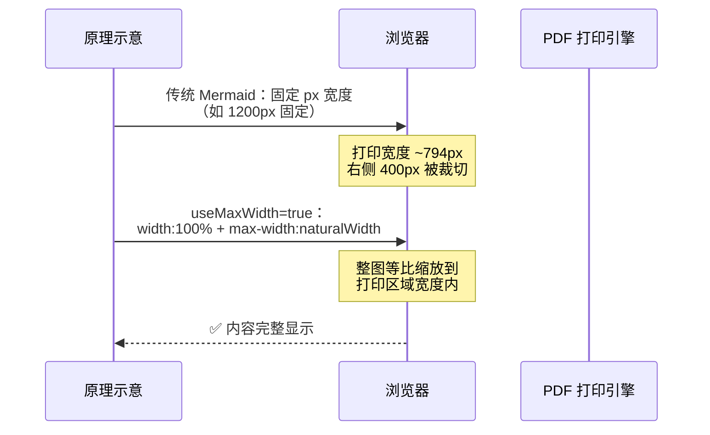
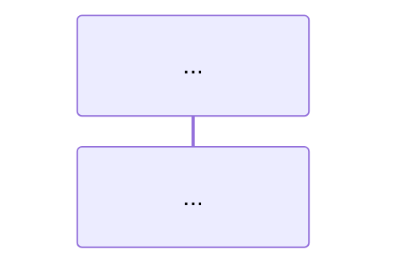
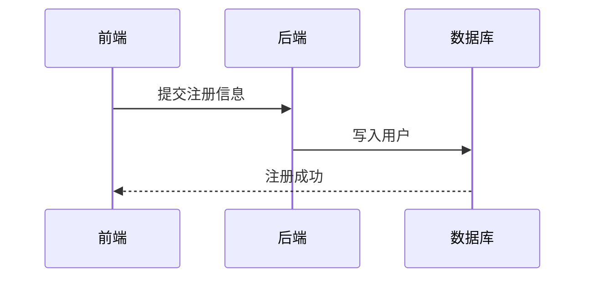
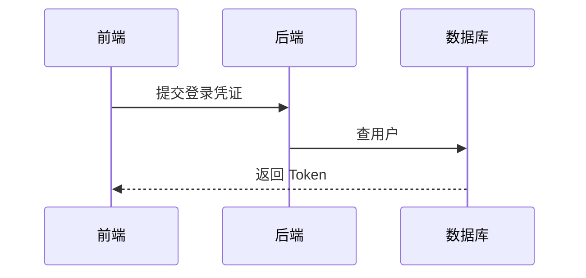

# Mermaid 图表 PDF 打印适配 Skill

## 何时触发

用户提到 Mermaid 图需要**自适应页面大小**、**打印被截断**、**显示不全**时触发。

典型触发场景：
- "Mermaid 自适应页面宽度/大小"
- "PDF 打印出来被截断了"
- "Mermaid 太大了，怎么缩小"
- "图超出页面了"
- "打印不全，右边被裁了"
- "Mermaid 怎么适配 A4 纸"

## 背景

Markdown 中的 Mermaid 序列图在 HTML 渲染时尺寸正常，但**打印为 PDF 时常被右侧截断**。根本原因是 Mermaid 默认生成固定宽度的 SVG，超过 A4 纸可打印区域宽度（约 700-800px）。

## 核心原理



关键配置就一行：

```
%%{init: {"sequence": {"useMaxWidth": true}}}%%
```

**原理**：`useMaxWidth: true` 使 SVG 采用 `width: 100%; max-width: [naturalWidth]` 的响应式布局。打印时浏览器自动将**整张图等比缩放**到页面可打印区域宽度内，字体、方框、箭头等所有元素同比例缩放，不会出现字大框小或框大字小的问题。

## 修复步骤

### 步骤一：给每个 sequenceDiagram 加 init 配置

在 Mermaid 代码块第一行、`sequenceDiagram` 之前插入：



实际写的时候注意：这一行必须放在 Mermaid 代码块内，```mermaid 和 sequenceDiagram 之间。

### 步骤二：缩短参与者名称（重要）

参与者名称中的 `<br/>` 会把名称框撑成双倍宽度，是导致图过宽的主要原因之一。

```diff
- participant B as FastAPI<br/>HTTPBearer    ← 名称框极宽
+ participant B as FastAPI HTTPBearer        ← 单行，宽度减半
```

注意：消息箭头内容（`F->>B: POST /auth/login<br/>{username, password}`）中的 `<br/>` 保留，因为它在竖排文本中反而减少宽度。

### 步骤三：不要加固定 width

```diff
- %%{init: {"sequence": {"useMaxWidth": true, "width": 700}}}%%
+ %%{init: {"sequence": {"useMaxWidth": true}}}%%
```

`width: 700` 会固定画布尺寸，导致缩放时字体和方框不同步。只用 `useMaxWidth: true`，让浏览器统一缩放。

### 步骤四（可选）：拆分过大图为多个小图

#### 何时拆

| 指标 | 阈值 | 后果 |
|------|------|------|
| 参与者数量 | ≥ 6 个 | 名称框占满横向空间，缩放后文字过小 |
| 消息步骤 | ≥ 15 步 | 纵向过长，需滚动阅读 |
| 单个 Note 文字 | ≥ 30 字 | 多行 Note 撑宽图，缩放后模糊 |
| 覆盖多个业务阶段 | 注册+登录+刷新画在一张 | 信息密度太高，反而不易理解 |

#### 怎么拆

按**逻辑阶段**拆，一个图只讲一件事：

```
❌ 错误：一张图画完整生命周期

    注册 → 登录 → 业务请求 → Token过期刷新 → 退出
    (5个阶段混在一起，又长又乱)

✅ 正确：每个阶段一张独立的图

    图 1：注册流程       (前端 → 后端 → 密码哈希 → 数据库)
    图 2：登录流程       (前端 → 后端 → 密码验证 → JWT签发)
    图 3：Token 刷新     (前端 → 后端 → JWT校验 → Redis)
    图 4：退出登录       (前端 → 后端 → Redis黑名单)
```

#### 拆分案例

**原始大图**（10 个参与者，25 步，一张图）：

```
注册→登录→请求→刷新→退出 全部塞在一起
```

**拆后效果**：

`````markdown
### 注册

`````

`````markdown
### 登录

`````

每张图控制在 **4-5 个参与者、8-12 步**之内，PDF 打印时即使缩放也清晰可读。

## 支持与限制

| 场景 | 是否支持 | 说明 |
|------|---------|------|
| `sequenceDiagram` | ✅ | `useMaxWidth` 原生支持 |
| `flowchart` / `graph` | ✅ | 同样支持，加 `%%{init: {"flowchart": {"useMaxWidth": true}}}%%` |
| `classDiagram` | ✅ | 同样支持 |
| `gantt` | ✅ | 同样支持 |
| `stateDiagram` | ✅ | 同样支持 |
| 其他图类型 | ⚠️ | 大部分支持，检查 Mermaid 文档 |
| 极宽表格类图 | ⚠️ | 缩放后可能文字过小，建议拆图 |

## 用户话术

当用户问"Mermaid 打印被截断怎么办"时，回答：

> 在 Mermaid 块开头加一行配置：
> ```
> %%{init: {"sequence": {"useMaxWidth": true}}}%%
> ```
> **原理**：`useMaxWidth: true` 使 SVG 采用 `width: 100%` 响应式布局，打印时浏览器自动将整图等比缩放到页面宽度内，所有元素（字体、方框、箭头）同比例缩放，不会截断。
>
> 同时把参与者名中的 `<br/>` 替换为空格（如 `FastAPI\nHTTPBearer` → `FastAPI HTTPBearer`），避免名称框过宽。
