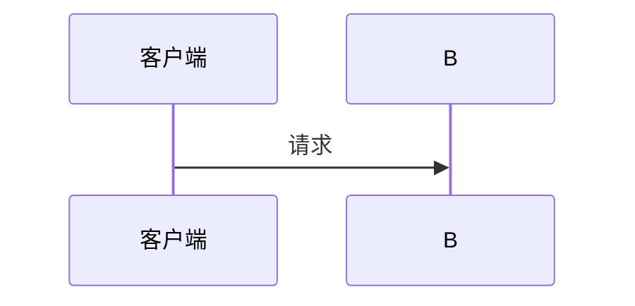
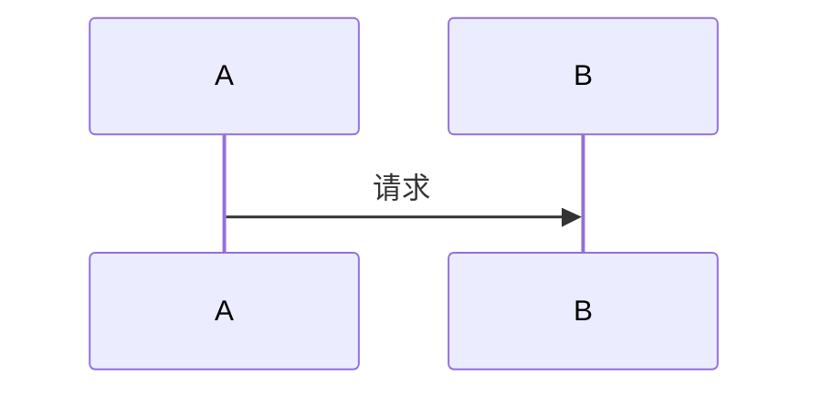
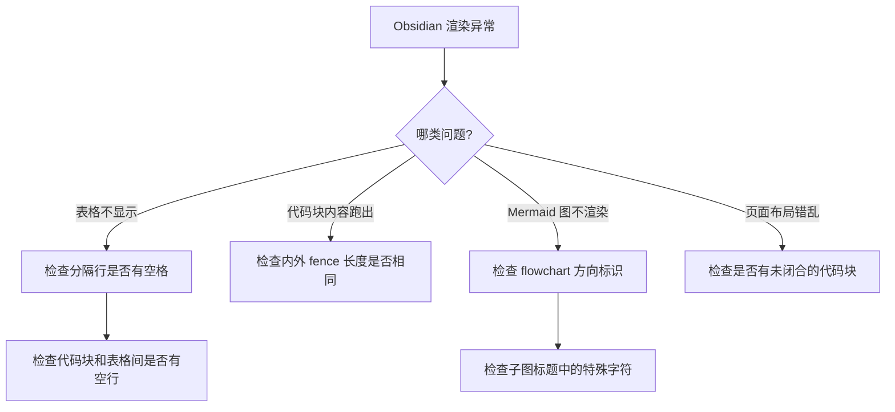

# Obsidian Markdown 渲染修复 Skill

Obsidian 实时预览的 Markdown 解析器比标准更严格，许多在 Typora / VS Code 预览中正常的写法，在 Obsidian 中会渲染失败。本 Skill 覆盖最常见的几类问题。

---

## 一、Fence 嵌套冲突

### 问题

在 Markdown 文档中展示包含代码块的代码示例时，内外层 fence 长度相同会导致解析错误。

````
```
外层用 3 个反引号定义代码块

```mermaid
sequenceDiagram          ← 内层也是 3 个反引号，解析器认为外层在此关闭
    A->>B: 请求
```
```
````

解析器遇到**第一个同长度 fence** 就关闭当前代码块。内外层同长度 → 内层 fence 被当作"关闭信号" → 后续内容脱离代码块。

### 出错表现

| 现象 | 怀疑 | 排查方法 |
| ---- | ---- | -------- |
| 代码块中出现了实际渲染的图形（Mermaid 图、表格） | 内层 fence 意外关闭了外层代码块 | 检查内外 fence 长度是否相同 |
| 代码块后半段变成纯文本，格式丢失 | fence 在中间被提前关闭 | 检查代码块内是否有同长度 fence |
| 页面中突然出现大量裸反引号或波浪线 | fence 数量不对，有未闭合的代码块 | 数一下开闭 fence 是否成对 |
| 表格显示不全，部分行变成普通文本 | 表格单元格内的 fence 打断了表格 | 检查表格中是否有 3+ 连续反引号 |

### 修复方案

#### 方案一：外层 fence 加长（最推荐）

外层用 4 个或 5 个反引号，内层保持 3 个。**原则**：外层 = 内层 + 1。

`````markdown
````markdown
### 示例

````
`````

#### 方案二：外层用波浪线 `~~~`

波浪线和反引号不互斥，可以相互嵌套。

`````markdown
~~~markdown
### 示例

~~~
`````

#### 嵌套层级速查表

| 嵌套层数 | 外层 fence | 内层 fence |
| -------- | ---------- | ---------- |
| 0 层（无嵌套） | 3 个反引号 | — |
| 1 层 | 4 个反引号 | 3 个反引号 |
| 2 层 | 5 个反引号 | 4 或 3 个反引号 |
| 3 层 | 6 个反引号 | 依此类推 |

---

## 二、表格分隔行格式

### 问题

Obsidian 实时预览要求表格分隔行每列之间用**空格隔开**，连写 `|------|` 不识别。

````markdown
<!-- ❌ 错误：分隔符连写，Obsidian 不渲染 -->
| 类型 | 触发方式 | 核心问题 |
|------|----------|----------|
| 立即执行 | 点击 | 异步处理 |

<!-- ✅ 正确：分隔符之间有空格 -->
| 类型 | 触发方式 | 核心问题 |
| ---- | ---------- | ----------- |
| 立即执行 | 点击 | 异步处理 |
````

### 规则

分隔行每个 `---` 之间必须用 ` | ` 隔开，每个 `---` 前后至少各一个空格，写成 `| ---- | ---- |`。

---

## 三、代码块与表格间距

### 问题

代码块结束符 ` ``` ` 后面直接跟表格，中间没有空行，Obsidian 不解析表格。

````markdown
<!-- ❌ 错误：代码块结束后直接写表格 -->

| 类型 | 说明 |
| ---- | ---- |
| A | B |

<!-- ✅ 正确：中间有空行 -->


| 类型 | 说明 |
| ---- | ---- |
| A | B |
````

### 规则

代码块结束后的 ` ``` ` 和下一行表格之间**必须空一行**。

---

## 四、内联代码中的 Fence

### 问题

内联代码 `` `...` `` 内部出现三个及以上反引号，解析器误判为 fence 开始。

```markdown
<!-- ❌ 错误 -->
在 ` ```mermaid ` 之后插入

<!-- ✅ 正确：换一种说法 -->
在 Mermaid 代码块第一行插入
```

### 规则

内联代码（`` `...` ``）内部不要出现三个及以上连续反引号。

---

## 五、Mermaid 语法要点

### flowchart 方向标识

`flowchart` 关键字后必须是方向标识（`TD`、`LR`、`TB`、`BT`、`RL`），不能是其他词：

```mermaid
<!-- ❌ 错误 -->
flowchart loop

<!-- ✅ 正确 -->
flowchart TD
```

### 子图标题中的特殊字符

子图标题含冒号等特殊字符时，用引号包裹更安全：

```mermaid
<!-- ⚠️ 可能出错 -->
subgraph 调度中心 [XXL-Job Admin :8088]

<!-- ✅ 更安全 -->
subgraph 调度中心 ["XXL-Job Admin :8088"]
```

---

## 六、修复优先级

遇到 Obsidian 渲染问题时，按以下顺序排查：



---

## 七、总结速查表

| 问题现象 | 根因 | 修复方式 |
| ---- | ---- | -------- |
| 表格完全不显示 | 分隔行没有空格（`|------|`） | 改为 `| ---- | ---- |` |
| 代码块下面表格不显示 | 代码块和表格之间没有空行 | 在 ` ``` ` 后加空行 |
| 代码块内容渲染成图形/表格 | 内外 fence 同长度 | 外层比内层多 1 个反引号 |
| Mermaid 图不渲染 | `flowchart` 后不是方向标识 | 改为 `flowchart TD` |
| 页面出现大量裸反引号 | 有未闭合的代码块 | 检查开闭 fence 是否成对 |
